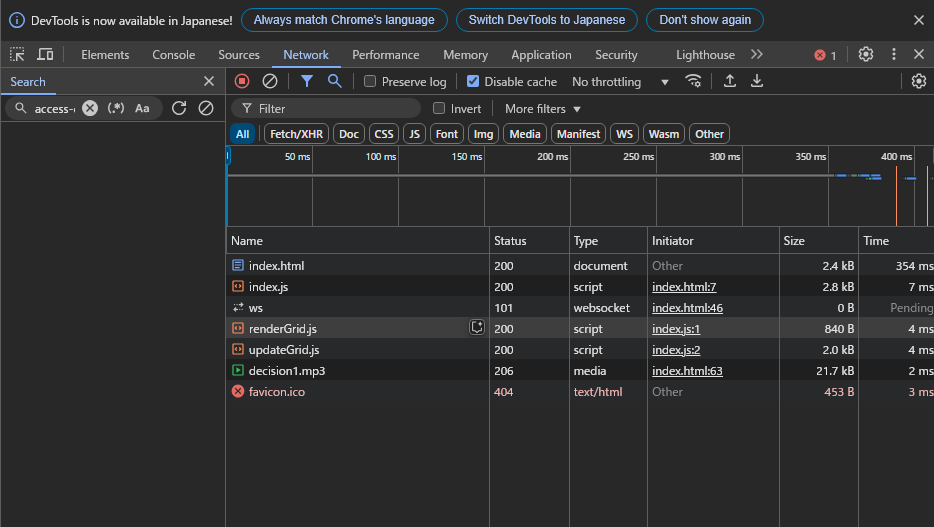

## バンドルしたコードと元のコードを比較

- `node=development` でバンドルを実行
- ローダーによる変換が行われている
- モジュールがバンドルされている

## バンドル前後の違い

vscode の Live Server 拡張機能でローカルサーバーで配信を行った

- バンドル前のコードを利用した場合

  - 
  - ページの読み込み時間: 354ms
  - スクリプトのダウンロード時間: 15 ms

- バンドル後のコードを利用した場合
  - 
  - ページの読み込み時間: 3ms
  - スクリプトのダウンロード時間: 6ms
