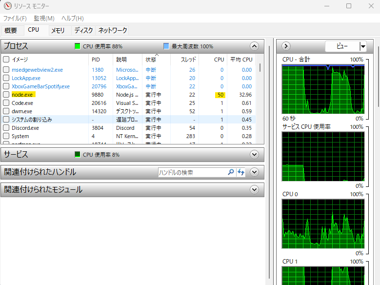
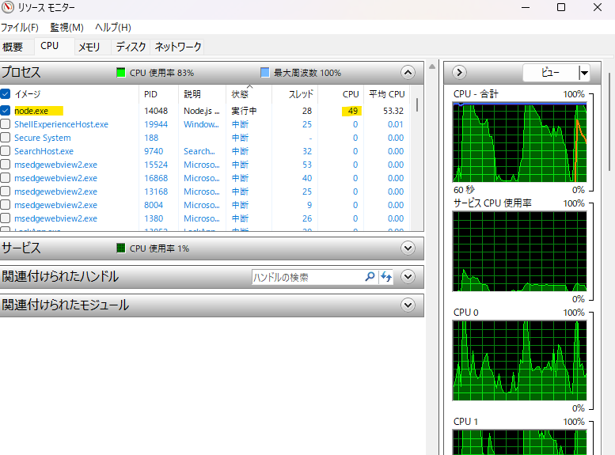
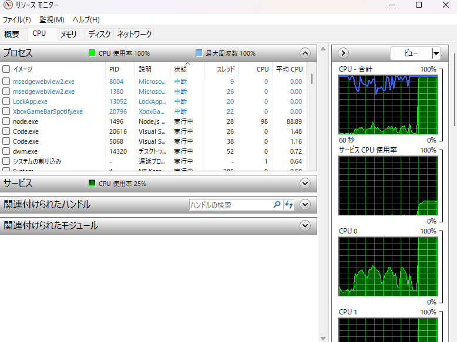

## マルチスレッドについて

マルチスレッドとは、一つのコンピュータープログラムを実行する際に、アプリケーションのプロセス（タスク）を複数のスレッドに分けて並行処理する流れのことです。マルチスレッドの対義語はシングルスレッドで、ソースコードの上から順に一つの処理を行ないます。

スレッドとはCPUから見たプログラムの実行単位であり、プロセスの中に組み込まれているものです。マルチスレッドとは、複数のスレッドが一つのプロセス内で実行されることを表します。

マルチスレッドを用いると、プロセス内で複数の処理を同時に行なうため、処理速度と精度が飛躍的に向上します。メインルーチンの処理に加え、サブルーチンの処理や複数のプロシージャも同時に処理できます。ただし、マルチスレッドはスレッドを高速で切り替えながら処理するため、切り替えのタイミングによってはバグを起こす可能性もあります。

CPUコアが複数あるコンピューターはマルチスレッド処理が可能です。ただし、単一のCPUであっても、利用時間を分割し、順番を割り当てることでマルチスレッドが可能になります。スレッドの管理をプログラム内のコードで行なうものをユーザースレッド、OSカーネルが行なうものをカーネルスレッドと呼びます。

引用 : https://www.ntt-west.co.jp/business/glossary/words-00262.html

## CPU スペック

コア数 6
論理プロセッサ数 12

12th Gen Intel(R) Core(TM) i5-12400 2.50 GHz

## 適切なスレッド数の考察

1コアにつき論理プロセッサ数が2なので、12スレッド並行で処理を行うことができる。
実際にフィボナッチの項数 60, スレッド数を6で実行する場合と、12で実行する場合の CPU の使用率を確認すると下記の結果が得られる

### 項数 50, スレッド数 6



これは各スレッドが実行完了する前の画像
CPU 使用率が 50% で張り付いているとが分かる

この 50% というのは、各コアで論理プロセッサとして 2つスレッドを利用できるが、各コア 1スレッドでしか動いていないので、半分の力で動作しているということが推測できる。

各スレッドの処理が完了すると、だんだんと CPU 使用率が落ちてきたことも確認できたので、展開しているスレッド内で処理を MAX で走らせていると 50% に張り付くことが分かる

結果

```
PS C:\codes\js-exercise\presets\js\ch16> node ex01/mFib.js 50 6
Worker 5 execution time: 6.894s
Worker 4 execution time: 11.206s
Worker 2 execution time: 17.032s
Worker 1 execution time: 26.899s
Worker 3 execution time: 45.639s
Worker 0 execution time: 1:14.121 (m:ss.mmm)
Total execution time: 1:14.125 (m:ss.mmm)
Fibonacci number: 20365011073
```

### 項数 50, スレッド数 12



各スレッドの処理が完了する前にキャプチャできなかったのでわかりにくいが、6スレッドのときよりも CPU 使用率が上がっているので、各コアで 2スレッドずつ立ち上がって実行していることがわかる

```
PS C:\codes\js-exercise\presets\js\ch16> node ex01/mFib.js 50 12
Worker 1 execution time: 568.407ms
Worker 8 execution time: 948.017ms
Worker 7 execution time: 1.363s
Worker 5 execution time: 2.115s
Worker 4 execution time: 3.005s
Worker 0 execution time: 4.645s
Worker 6 execution time: 7.037s
Worker 9 execution time: 11.072s
Worker 3 execution time: 16.645s
Worker 11 execution time: 26.092s
Worker 10 execution time: 43.084s
Worker 2 execution time: 1:11.628 (m:ss.mmm)
Total execution time: 1:11.632 (m:ss.mmm)
Fibonacci number: 20365011073
```

全体の処理時間も6スレッドと比べると 3s 早くなっている

### 考察まとめ

項数を60に増やして実行すると CPU 使用率が 約100% に張り付くことも確認できた



このことから、処理を最も効率よく行うスレッド数は論理プロセッサ数分のスレッドと考えられる
